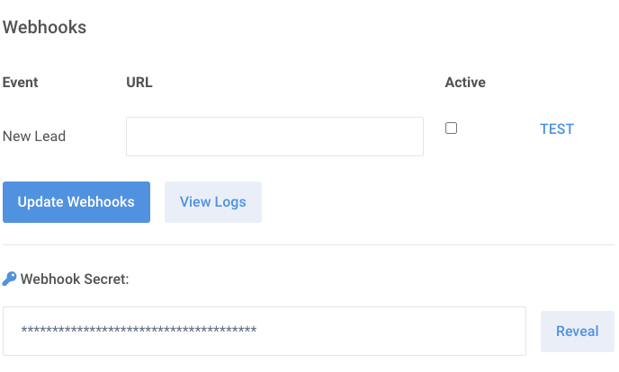

# LeaseFetcher Webhooks

## Introduction

A webhook is a request that LeaseFetcher sends to your server to alert you of an event. Adding support for webhooks allows you to receive real-time notifications from LeaseFetcher when things happen in your account, so you can take automated actions in response, for example:

 - When a new lead comes in, submit it to your CRM
 - When a new lead comes in, send an automated response to the customer

## Subscribing to Events

Login to your [LeaseFetcher Dashboard](https://www.leasefetcher.co.uk/login) and click on **Account Settings** > **Integrations**

Here you should see a list of all available events to which you can subscribe, with an option to add in a URL endpoint.

Simply enter the URL to which you would like LeaseFetcher to send the webhook and click **Update Webhooks.**

Now, whenever an event occurs, LeaseFetcher will POST data about the event to your specified endpoint allowing you to respond to the event in any way you choose.



## Webhook Format

All webhooks will be sent as a **POST** request to your configured endpoint and will be formatted as **JSON.**

To see examples of the data sent for each event please click [here](#example-payloads).

## Testing Webhooks

Webhooks can be tested by clicking the **TEST** button next to the appropriate webhook. Simply enter the URL to which you would like the example payload to be sent and click the **Send Test** button.

The webhook will be sent and you will be redirected to a page showing you the response received from the server.

## Failed Webhooks

Any webhook which does not receive a 2xx response from your server will be considered failed.

Failed webhooks will be retried every 5 minutes up to a maximum of 20 times.

After 20 consecutive failues the webhook will be deactivated and you will be sent an email informing you.

## Webhook Signatures

Webhooks will be sent with an HTTP header called `X-LeaseFetcher-Signature` and this can optionally be used to determine whether or not the webhook has actually been sent by LeaseFetcher and the payload has not been tampered with.

### Verifying the Signature

Before the signature can be verified you will need to retrieve your **Webhook Secret**. This can be found in your [LeaseFetcher Dashboard](https://www.leasefetcher.co.uk/login) under **Account Settings** > **Integrations**.

LeaseFetcher generates signatures using a hash-based message authentication code (HMAC) with SHA-256. You can verify the signature by following these steps: 

#### Step 1: Extract the signature from the header

Parse the headers from the request and extract the value for the one called `X-LeaseFetcher-Signature`

```php
// retrieve the incoming http headers
$headers = getallheaders();

// extract the signature sent by LeaseFetcher
$signature = $headers['X-LeaseFetcher-Signature'];
```

#### Step 2: Determine the expected signature

Compute an HMAC with the SHA256 hash function. Use your webhook secret as the key, and use the payload string as the message.

```php
// your webhook secret obtained from your LeaseFetcher dashboard
$secret = 'YOUR-SECRET-KEY';

// generate the expected signature based on webhook payload and secret
$expected = hash_hmac('sha256', $content, $secret);
```

#### Step 3: Compare the signatures

Compare the signature sent by LeaseFetcher and the expected signature which you've just generated and if they match then the webhook is genuine.

```php
// if the signatures don't match then don't process the webhook
if( $signature !== $expected )
{
	// exit handler
}
```

## Example Payloads

### New Lead

```json
{
	"id": 7527,
	"message": "Hi there, what colours is this available in?",
	"initial_rental": 9,
	"term": 48,
	"mileage": 8000,
	"rental": 139.74,
	"finance_type": "Personal",
	"price_reference": "xxx-000111",
	"selected_at": 1557146693,
	"client": {
		"id": 100,
		"first_name": "Michael",
		"last_name": "Bluth",
      	"email": "michael@thebluthcompany.com",
      	"phone_number": "07900000000"
	},
	"car": {
		"cap_id": 86491,
		"derivative": "1.2 3 5dr",
		"trim": "3",
		"model": "Mirage Hatchback",
		"manufacturer": "Mitsubishi"
	}
}
```

## Example Webhook Handler (PHP)
```php

// get the payload
$content = @file_get_contents('php://input');

// retrieve the incoming http headers
$headers = getallheaders();

// extract the signature sent by LeaseFetcher
$signature = $headers['X-LeaseFetcher-Signature'];

// your webhook secret obtained from your LeaseFetcher dashboard
$secret = 'YOUR-SECRET-KEY';

// generate the expected signature based on webhook payload and secret
$expected = hash_hmac('sha256', $content, $secret);

// if the signatures don't match then don't process the webhook
if( $signature !== $expected )
{
	echo 'Invalid Signature';

	http_response_code(403);

	exit();
}

// the deal object
$deal = json_decode($content);

// the client object
$client = $deal->client;

// the car object
$car = $deal->car;

// write some code here to do whatever you need to do with the webhook e.g.
// send it to your CRM

// return successful http status code
http_response_code(200);

exit();
```